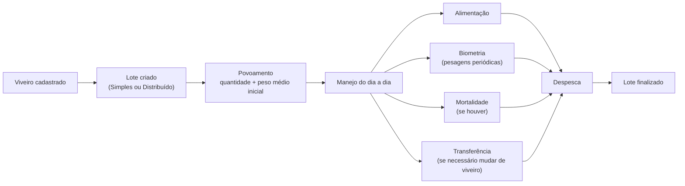

# Manual do Usuário — Piuba

**Sistema de gestão para fazendas de camarão**

Este manual explica como usar o Piuba no dia a dia: como entrar no sistema,
cadastrar sua equipe, registrar viveiros e lotes, e acompanhar o ciclo de
produção até a despesca.

> Para detalhes técnicos de implementação, consulte o
> [Manual Técnico-Funcional](./manual-tecnico-funcional.md).

---

## 1. Bem-vindo ao Piuba

O Piuba ajuda fazendas de camarão a organizar toda a operação em um só lugar:
quem trabalha na fazenda, quais viveiros existem, quais lotes estão em
produção, e o que acontece com cada lote — alimentação, crescimento,
mortalidade, transferências e colheita — até a venda final.

### Quem usa o Piuba

| Perfil | O que faz no sistema |
|---|---|
| **Operador de campo** | Registra o dia a dia: alimentação, pesagens (biometria), mortalidade. |
| **Gerente de produção** | Além do dia a dia, cria e edita lotes e viveiros, acompanha colheitas e aprova vendas. |
| **Administrador da empresa** | Gerencia a equipe (cadastra e remove usuários), controla o financeiro e as configurações da fazenda. |

Cada pessoa só vê e faz o que o seu nível de acesso permite — isso é
explicado em detalhe na seção 4.

---

## 2. Primeiros passos

### 2.1 Entrando no sistema

1. Acesse a tela de login do Piuba.
2. Informe seu e-mail e senha cadastrados.
3. Você será direcionado ao Dashboard da sua empresa.

Se é a primeira vez que você acessa e ainda não tem senha, veja a seção 4.3
— o administrador da sua empresa precisa te repassar o acesso inicial.

### 2.2 Se você trabalha em mais de uma empresa

Algumas pessoas atuam em mais de uma fazenda cadastrada no Piuba. Se for o
seu caso, use a opção de **trocar de empresa** disponível no menu do sistema
para alternar entre elas sem precisar sair e entrar novamente.

### 2.3 Se você é novo na fazenda (primeiro acesso)

Se a sua empresa acabou de começar a usar o Piuba e ainda não tem nenhum
viveiro cadastrado, o sistema vai te guiar automaticamente por um assistente
de boas-vindas assim que você entrar, pedindo para cadastrar o seu primeiro
viveiro (veja seção 5). Esse é o único passo coberto pelo assistente — os
demais cadastros (equipe, lotes) são feitos normalmente pelas telas do
sistema.

---

## 3. Minha Empresa

A empresa (fazenda) em que você trabalha já vem cadastrada no Piuba pela
nossa equipe de implantação — isso não é algo que você configura sozinho.
Se você precisar:

- **Corrigir dados cadastrais da empresa** (nome, CNPJ, endereço, telefone),
- **Alterar o plano/assinatura contratada**,

fale com o administrador da sua empresa ou com o suporte Piuba.

Dentro do sistema, quem tem o nível **Administrador da Empresa** pode
ajustar as configurações da fazenda diretamente na tela de configurações.

---

## 4. Equipe e Permissões

### 4.1 Os níveis de acesso

O Piuba organiza o acesso da sua equipe em níveis. Cada nível já vem com um
conjunto de permissões pensado para a função da pessoa — você não precisa
configurar permissão por permissão na maioria dos casos.

| Nível | Indicado para | O que consegue fazer |
|---|---|---|
| **Operador** | Quem trabalha no campo, no dia a dia dos viveiros | Registrar alimentação, biometria (pesagens) e mortalidade; consultar lotes, viveiros e vendas. Não edita nem exclui cadastros. |
| **Gerente** | Quem coordena a produção | Tudo do operador, mais: criar e editar lotes e viveiros, cadastrar sensores, gerenciar colheitas, aprovar vendas. Vê o financeiro, mas não edita. |
| **Administrador** | Quem responde pela operação e pela equipe | Tudo do gerente, mais: cadastrar e gerenciar usuários, financeiro completo (aprovar pagamentos), excluir cadastros como sensores e produtos. |
| **Administrador da Empresa** | Dono ou responsável máximo pela fazenda dentro do Piuba | Tudo do administrador, mais: editar dados e configurações da própria empresa, e é o único nível que pode excluir um lote. |

Existe ainda um nível interno da equipe Piuba (suporte da plataforma), que
não pertence à sua empresa — ele é usado apenas para tarefas de
administração da plataforma como um todo (criação de novas fazendas
clientes, por exemplo).

**Regra importante:** uma pessoa só pode dar a outra um nível de acesso
**até o próprio nível, nunca mais alto**. Ou seja, um Administrador pode
promover alguém a Administrador, mas não a Administrador da Empresa.

### 4.2 Cadastrando uma nova pessoa na equipe

1. Vá em **Dashboard → Usuários**.
2. Clique em **Novo Usuário**.
3. Preencha nome, e-mail, telefone, cargo e o nível de acesso desejado.
4. Salve.

> **Observação sobre a senha:** hoje o cadastro não envia a senha
> automaticamente por e-mail para a pessoa nova. Depois de cadastrar
> alguém, **fale com o suporte Piuba** para que o acesso inicial seja
> configurado e repassado a essa pessoa com segurança. Vamos avisar aqui
> assim que esse passo passar a ser automático.

### 4.3 Adicionando alguém que já tem conta em outra empresa

Se a pessoa já usa o Piuba em outra fazenda e agora também vai trabalhar na
sua, você não precisa cadastrá-la de novo:

1. Vá em **Dashboard → Usuários**.
2. Use a opção de **adicionar membro existente**, informando o e-mail já
   cadastrado e o nível de acesso que ela terá na sua empresa.

### 4.4 Trocando o nível de acesso de alguém

Na tela de Usuários, abra o cadastro da pessoa e altere o nível de acesso.
Lembre-se da regra da seção 4.1: você só consegue promover alguém até o seu
próprio nível.

---

## 5. Viveiros

Viveiro é a estrutura onde os camarões são criados. É normalmente o
primeiro cadastro feito numa fazenda nova.

**Como cadastrar:**

1. Vá em **Viveiros → Novo Viveiro**.
2. Informe nome, capacidade, localização e o tipo de viveiro.
3. Salve — o viveiro já fica disponível para receber um lote.

Cada viveiro tem um histórico próprio, que registra automaticamente os
eventos que acontecem nele ao longo do tempo (manejo, transferências).

---

## 6. Lotes

Um **lote** é o grupo de camarões alocado a um viveiro específico — com uma
espécie, um tipo de cultivo e uma quantidade inicial. Um viveiro só pode ter
**um lote ativo por vez**.

O Piuba tem duas formas de cadastrar um lote: **Simples**, para quando você
está lançando um lote de cada vez, e **Distribuído**, para quando uma única
compra de pós-larvas vai ser dividida entre vários viveiros de uma só vez.

### 6.1 Modo Simples (um lote, um viveiro)

Use quando você quer cadastrar um lote por vez.

1. Vá em **Lotes → Novo Lote** e escolha a aba **Simples**.
2. Selecione o viveiro (só aparecem viveiros livres, sem lote ativo).
3. Dê um nome ao lote, escolha a espécie e o tipo de cultivo (berçário ou
   engorda).
4. Informe a quantidade inicial e a data de entrada.
5. Salve.

### 6.2 Modo Distribuído (uma compra, vários viveiros)

Use quando você comprou um lote de pós-larvas e vai dividir essa mesma
compra entre vários viveiros ao mesmo tempo.

1. Vá em **Lotes → Novo Lote** e escolha a aba **Distribuído**.
2. Preencha os dados da compra: fornecedor, custo total, data, espécie e
   tipo de cultivo.
3. Adicione uma linha para cada viveiro que vai receber parte da compra,
   informando o viveiro, a quantidade e o peso médio.
4. Salve.

O sistema vai criar um lote em cada viveiro escolhido, dividindo o custo
total da compra proporcionalmente entre eles conforme a quantidade de cada
um, e já registra automaticamente a despesa dessa compra no financeiro,
vinculada ao fornecedor. Depois de criados, cada lote passa a ser editado
individualmente (não é possível editar a distribuição inteira de uma vez).

### 6.3 Encerrando um lote

Quando o ciclo do lote terminar (após a despesca final), vá até o lote e
use a opção **Finalizar Lote**, informando o peso total colhido e o preço
por quilo. O sistema calcula automaticamente o relatório final do lote,
incluindo o custo de ração consumida.

---

## 7. Ciclo de Produção

Depois que um lote é criado num viveiro, o próximo passo é registrar o
**povoamento** — e a partir daí, o dia a dia de manejo do lote.

### 7.1 Povoamento

1. Vá em **Povoamento → Novo Povoamento**.
2. Selecione o lote, informe a quantidade e o peso médio inicial dos
   camarões colocados no viveiro.
3. Salve. A partir daqui o sistema passa a acompanhar a quantidade e a
   biomassa (peso total estimado) desse lote automaticamente, atualizando
   conforme você registra alimentação, biometria e mortalidade.

### 7.2 Alimentação

Registre cada alimentação em **Alimentação → Nova Alimentação**, informando
o lote, a quantidade de ração e a data. Cada registro fica salvo no
histórico do lote automaticamente.

### 7.3 Biometria (pesagens periódicas)

A biometria é a pesagem de uma amostra de camarões para estimar o peso
médio e a biomassa total do lote, além da conversão alimentar (quanto de
ração está sendo gasto por quilo de camarão produzido).

1. Vá em **Biometria → Nova Biometria**.
2. Selecione o lote e informe o peso e a quantidade da amostra coletada.
3. Salve. O peso médio e a biomassa estimada do lote são atualizados
   automaticamente.

### 7.4 Mortalidade

Sempre que houver perda de camarões, registre em
**Mortalidade → Nova Mortalidade**, informando o lote, a quantidade, a
causa e a severidade. A quantidade atual do lote é ajustada
automaticamente.

### 7.5 Transferência

Se for necessário mover camarões de um viveiro para outro durante o ciclo,
use **Transferências → Nova Transferência**, informando o lote de origem,
o viveiro de destino e a quantidade transferida. Dependendo do caso, isso
pode gerar um novo lote no viveiro de destino.

### 7.6 Despesca (colheita)

Há duas formas de registrar a despesca, dependendo do seu processo:

- **Despesca formal**: vá em **Despesca → Nova Despesca** e escolha o tipo
  (total, parcial, seletiva ou emergencial), o destino comercial da
  produção e a quantidade colhida. O sistema calcula a taxa de
  sobrevivência e o lucro da despesca.
- **Venda vinculada ao lote**: se você já está lançando a venda dessa
  produção, vinculando-a ao lote/povoamento, o sistema encerra o
  povoamento automaticamente ao registrar a venda.

> **Atenção:** encerrar o povoamento (pela venda ou pela despesca) e
> **finalizar o lote** (seção 6.3) são duas ações diferentes. Depois da
> despesca, lembre-se também de finalizar o lote para fechar o relatório
> final e liberar o viveiro para um novo lote.

---

## 8. Perguntas frequentes

**Por que não consigo criar um lote num viveiro que já tem lote?**
Cada viveiro só pode ter um lote ativo por vez. Finalize o lote atual
(seção 6.3) antes de cadastrar um novo nesse viveiro.

**Qual a diferença entre o modo Simples e o Distribuído na criação de
lote?**
Simples cadastra um lote de cada vez, num viveiro só. Distribuído cadastra
vários lotes de uma vez, um por viveiro, a partir de uma única compra —
útil quando você recebe pós-larvas e já sabe como vai dividi-las entre os
viveiros.

**Cadastrei um usuário novo, mas ele não consegue entrar no sistema.**
Hoje o Piuba ainda não envia a senha automaticamente para pessoas recém-
cadastradas. Entre em contato com o suporte Piuba para configurar o acesso
inicial dessa pessoa.

**Posso dar a alguém um nível de acesso mais alto que o meu?**
Não. Você só pode atribuir níveis até o seu próprio nível de acesso.

---

## 9. Glossário

| Termo | O que significa |
|---|---|
| **Viveiro** | Estrutura onde os camarões são criados. |
| **Lote** | Grupo de camarões alocado a um viveiro, com espécie e quantidade definidas. |
| **Lote distribuído** | Conjunto de lotes criados juntos, a partir de uma única compra, um por viveiro. |
| **Povoamento** | Ato de colocar os camarões no viveiro para dar início ao cultivo. |
| **Berçário** | Fase inicial de cultivo, com camarões ainda pequenos, antes da engorda. |
| **Engorda** | Fase de crescimento até o tamanho de venda. |
| **Biometria** | Pesagem periódica de uma amostra de camarões para acompanhar crescimento e biomassa. |
| **Biomassa** | Peso total estimado dos camarões vivos no viveiro. |
| **Conversão alimentar (FCR)** | Quanto de ração é gasto para produzir um quilo de camarão — quanto menor, mais eficiente. |
| **Despesca** | Colheita dos camarões do viveiro para venda. |
| **Taxa de sobrevivência** | Percentual de camarões que sobreviveram do povoamento até a despesca. |
| **Mortalidade** | Perda de camarões durante o ciclo de produção. |
| **Transferência** | Movimentação de camarões de um viveiro para outro. |
