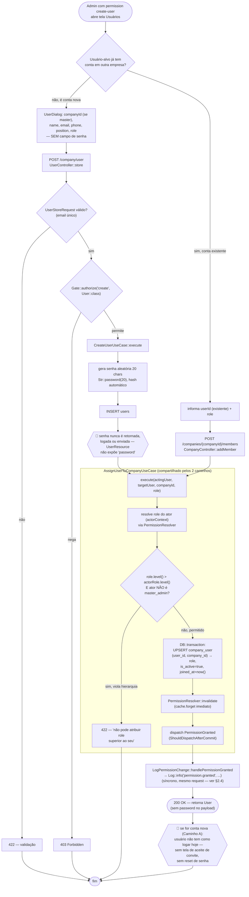
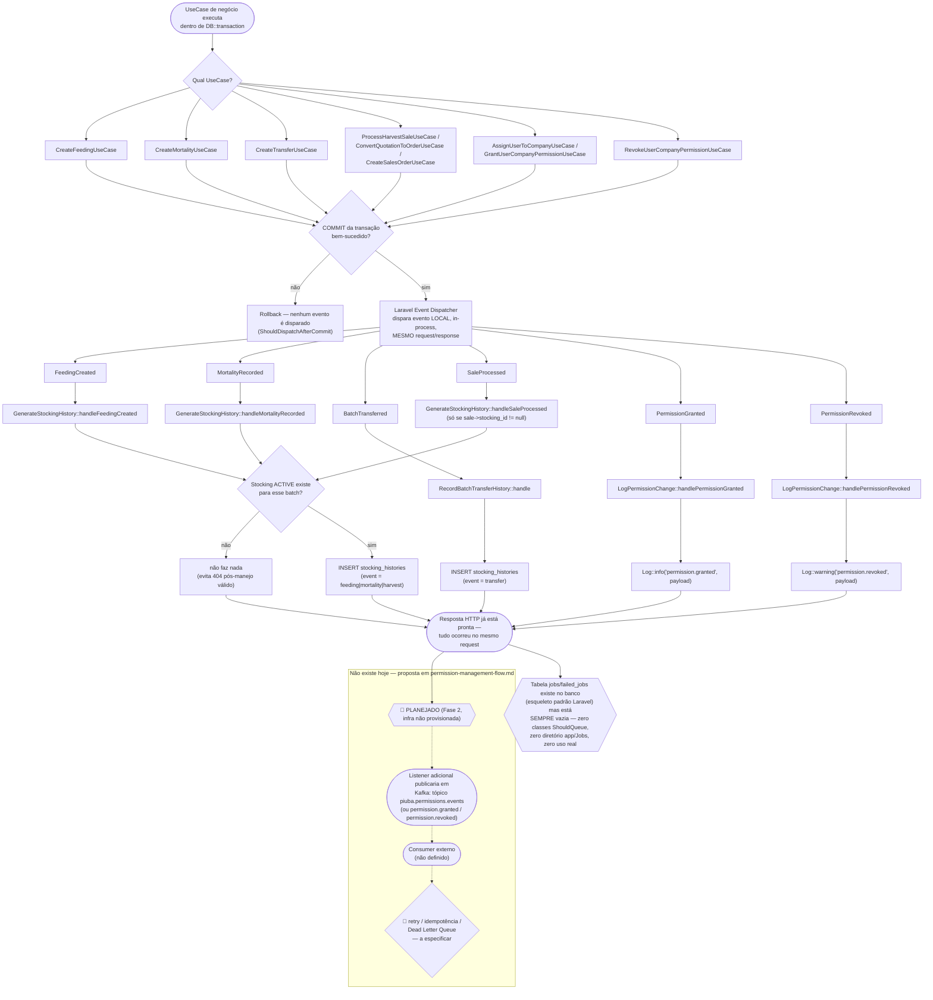

# Manual Técnico-Funcional — Piuba

**Sistema de Gestão de Carcinicultura (SaaS multi-tenant)**

> Versão do documento: 2026-08-07
> Repositórios cobertos: `backend/piuba-api` (Laravel 12) e `frontend/piuba-pescado-erp` (Next.js)

---

## Nota de fidelidade ao código (leia antes de usar este manual)

Este manual foi escrito lendo o código-fonte real dos dois repositórios, não a
partir de intenção de produto ou de documentação anterior. Em vários pontos o
sistema **hoje** se comporta de forma diferente do que o nome das telas ou das
tabelas sugere. Os pontos abaixo são citados novamente, em contexto, ao longo do
documento — aqui vão resumidos para quem for usar este manual para treinar
usuários ou tomar decisões de produto:

| # | O que o nome sugere | O que o código realmente faz hoje |
|---|---|---|
| 1 | "Onboarding" = uma empresa nova se cadastra sozinha (self-signup) | **Não existe self-signup.** Só um `master_admin` pode criar uma empresa (`POST /admin/company`). "Onboarding" no frontend é, na verdade, um assistente pós-login que guia o cadastro do **primeiro viveiro** — nada mais. |
| 2 | "Convite de usuário" | **Não existe convite por e-mail.** Um admin cadastra o usuário diretamente com uma senha aleatória gerada no servidor — essa senha nunca é exibida, logada ou enviada por e-mail. Não há fluxo de "definir senha" nem "esqueci minha senha". Isto é uma lacuna funcional real, documentada na seção 4.3. |
| 3 | "Eventos assíncronos via Kafka" | **Não há Kafka no sistema.** Os eventos de domínio (`FeedingCreated`, `MortalityRecorded`, `BatchTransferred`, `PermissionGranted` etc.) são despachados localmente pelo Event Dispatcher do Laravel, **de forma síncrona**, dentro do mesmo request, logo após o commit da transação. Não há fila, não há broker, não há DLQ, não há consumidor externo. A tabela `jobs`/`failed_jobs` existe no banco (esqueleto padrão do Laravel) mas está vazia e não é usada por nenhum código da aplicação. |

Este manual documenta o comportamento **real** (seções numeradas) e sinaliza
explicitamente, com o marcador **🔶 Planejado / não implementado**, qualquer
trecho que descreva algo que ainda não existe em produção — para que o
fluxograma sirva tanto de manual de uso quanto de mapa preciso de onde estão os
gaps do sistema.

---

## 1. Visão geral

Piuba é um sistema de gestão (ERP) especializado em **carcinicultura** — a
criação comercial de camarões em viveiros/tanques — operado como **SaaS
multi-tenant**: cada empresa cliente (fazenda de camarão) é isolada como um
*tenant*, com seus próprios usuários, viveiros, lotes e dados financeiros,
todos hospedados na mesma aplicação.

### Público-alvo

| Perfil | Papel no sistema (role) | O que faz no dia a dia |
|---|---|---|
| **Operador de campo** | `operator` | Registra manejo diário: alimentação, biometria, mortalidade. Consulta lotes e viveiros. |
| **Gerente de produção** | `manager` | Tudo do operador + cria/edita lotes, viveiros, sensores, colheitas, aprova vendas, gerencia estoque de ração/insumos. |
| **Administrador da empresa** | `admin` / `company_admin` | Tudo do gerente + gerencia usuários e permissões, financeiro completo, exclusão de registros críticos, configurações da empresa. `company_admin` é o nível mais alto **dentro de uma empresa**. |
| **Administrador da plataforma (Piuba)** | `master_admin` | Acesso global, cross-tenant: cria empresas, gerencia assinaturas, bypassa toda checagem de tenant/permissão. Não pertence a nenhuma empresa específica. |

A hierarquia é numérica e estrita — ver seção 4.2.

---

## 2. Fluxogramas

### 2.1 Fluxo de onboarding de empresa (tenant)

```mermaid
flowchart TD
    Start([master_admin autenticado]) --> CreateCo["POST /admin/company<br/>CompanyController::store"]
    CreateCo --> ValReq{"CompanyStoreRequest válido?<br/>(name, cnpj único, phone, endereço)"}
    ValReq -->|não| Err422A["422 — erros de validação<br/>(inclui CNPJ::isValid, dígitos verificadores)"]
    ValReq -->|sim| CreateUC["CreateCompanyUseCase::execute<br/>DB::transaction"]
    CreateUC --> CompanyRow["INSERT companies<br/>status default"]
    CompanyRow --> CoCreated(["Company criada<br/>SEM usuário, SEM assinatura vinculada"])

    CoCreated --> SubDecision{"master_admin quer<br/>vincular assinatura agora?"}
    SubDecision -->|sim| SubCreate["POST /admin/subscription<br/>SubscriptionController::store<br/>(plan, status, start_date, end_date)"]
    SubDecision -->|não/depois| SkipSub[/"pode ser feito depois,<br/>é uma chamada independente"/]
    SubCreate --> FirstUser
    SkipSub --> FirstUser

    FirstUser["master_admin cria o 1º usuário<br/>POST /company/user<br/>role sugerido: company_admin"] --> CreateUserUC["CreateUserUseCase::execute"]
    CreateUserUC --> GenPwd["gera senha aleatória de 20 chars<br/>Str::password(20) — hash automático"]
    GenPwd --> GapPwd{{"🔶 GAP: senha não é exibida,<br/>logada nem enviada por e-mail —<br/>ver §4.3"}}
    GapPwd --> AssignUC["AssignUserToCompanyUseCase::execute<br/>UPSERT company_user (role, is_active, joined_at)"]
    AssignUC --> EmitPG["dispatch PermissionGranted<br/>(after commit, síncrono — ver §2.4)"]
    EmitPG --> UserReady(["Usuário vinculado à empresa<br/>role=company_admin"])

    UserReady --> LoginGap{{"🔶 Como o usuário obtém a senha?<br/>Hoje: intervenção manual<br/>(reset direto no banco / suporte)"}}
    LoginGap --> Login["Usuário faz login<br/>POST /auth/login → JWT com cid+role"]

    Login --> Gate{"useOnboardingGate (frontend):<br/>isCompanyAdmin() && hasCompany()<br/>&& nenhum tanque cadastrado?"}
    Gate -->|não| Dashboard([Vai direto ao Dashboard])
    Gate -->|sim| Wizard["OnboardingWizardModal<br/>exibe passo único: 'tanks'"]

    Wizard --> ApiCall["GET/PUT /api/company/onboarding/steps/[step]<br/>(proxy Next.js)"]
    ApiCall --> BackendGap{{"🔶 GAP: endpoint de onboarding<br/>NÃO existe no backend Laravel<br/>(contrato assumido, retry:false)"}}
    BackendGap -.->|chamada real falha silenciosamente| ClientFallback["Progresso inferido no client:<br/>useTanks() — lista de tanques vazia?"]

    ClientFallback --> CreateTank["Usuário cadastra 1º viveiro<br/>POST /company/tank"]
    CreateTank --> TankExists{"useTanks() retorna<br/>ao menos 1 tanque?"}
    TankExists -->|sim| StepDone["Passo 'tanks' marcado concluído<br/>(client-side)"]
    TankExists -->|não| Wizard
    StepDone --> Dashboard
    Dashboard --> End([Empresa operacional —<br/>pronta para criar lotes])
```

**Leitura do fluxo:** não existe "onboarding de empresa" no sentido de
autocadastro. O processo real tem três atores em sequência obrigatória —
`master_admin` cria a empresa, `master_admin` cria o primeiro usuário, esse
usuário (assumindo que consiga logar) passa por um assistente que só cobre o
cadastro do primeiro viveiro. Assinatura/plano é opcional e desacoplada.

---

### 2.2 Fluxo de criação de Lote (Batch): modo Simples vs. modo Distribuído

```mermaid
flowchart TD
    Start([Usuário com permission create-batch<br/>abre formulário de Lote]) --> Mode{"Aba selecionada no BatchForm"}

    %% ===== MODO SIMPLES =====
    Mode -->|Simples| SForm["Preenche: tankId, name, species,<br/>cultivation (growout|nursery),<br/>initialQuantity, entryDate, description?"]
    SForm --> SSubmit["POST /company/batch<br/>BatchController::store"]
    SSubmit --> SValid{"BatchStoreRequest válido?"}
    SValid -->|não| SErr422["422 — validação"]
    SValid -->|sim| SCreateUC["CreateBatchUseCase::execute"]
    SCreateUC --> SCheckActive{"ValidateActiveBatchInTankAction:<br/>tanque já tem lote ACTIVE?"}
    SCheckActive -->|sim| SErrActive["TankAlreadyHasActiveBatchException<br/>(422)"]
    SCheckActive -->|não| SInsert["INSERT batches<br/>status=ACTIVE, tank_id=1 tanque,<br/>parent_group_id=NULL"]
    SInsert --> BatchReady

    %% ===== MODO DISTRIBUÍDO =====
    Mode -->|Distribuído| DForm["Preenche cabeçalho da compra:<br/>supplierId, totalCost, entryDate,<br/>species, cultivation, notes?<br/>+ N linhas: {tankId, quantity, averageWeight}"]
    DForm --> DSubmit["POST /company/batches/distribution<br/>BatchController::distribution"]
    DSubmit --> DValid{"BatchDistributionStoreRequest válido?<br/>(≥1 linha na distribuição)"}
    DValid -->|não| DErr422["422 — validação"]
    DValid -->|sim| DUC["DistributeBatchUseCase::execute"]
    DUC --> DCheckTanks{"ValidateTanksForDistributionAction:<br/>algum tanque já ACTIVE OU<br/>tanques de empresas diferentes?"}
    DCheckTanks -->|inválido| DErrTank["TankAlreadyHasActiveBatchException<br/>ou DistributionCrossCompanyException (422)"]
    DCheckTanks -->|válido| DCreate["CreateDistributedBatchesAction"]
    DCreate --> GenGroup["gera parentGroupId (UUID)<br/>compartilhado por todos os lotes irmãos"]
    GenGroup --> GenPayable["GeneratePayableAction:<br/>cria despesa a pagar<br/>FinancialType::PURCHASE<br/>vinculada a supplierId + parentGroupId"]
    GenPayable --> LoopTanks["para cada linha da distribuição:"]
    LoopTanks --> CalcCost["CalculateProportionalCostAction<br/>unit_cost = quantity/totalQuantity * totalCost"]
    CalcCost --> GenName["GenerateBatchNameAction<br/>(nome automático do lote)"]
    GenName --> DInsert["INSERT batches<br/>status=ACTIVE, tank_id=1 dos tanques,<br/>parent_group_id=grupo compartilhado,<br/>unit_cost/total_cost calculados"]
    DInsert --> MoreTanks{"há mais linhas<br/>na distribuição?"}
    MoreTanks -->|sim| LoopTanks
    MoreTanks -->|não| BatchReady

    BatchReady(["N lote(s) ACTIVE criado(s)<br/>(1 lote = sempre 1 tanque, mesmo no modo distribuído)"])
    BatchReady --> Stocking["Etapa seguinte, separada:<br/>POST /company/stocking (povoamento)<br/>vincula quantity+averageWeight ao batch_id<br/>— ver §4.4"]
    Stocking --> End([Lote pronto para o ciclo de produção])
```

**Leitura do fluxo:** "modo Distribuído" não cria um único registro
multi-tanque — ele cria **vários `Batch`** (um por tanque escolhido), todos
marcados com o mesmo `parent_group_id`, e rateia o custo total da compra
proporcionalmente à quantidade de cada tanque. O modo Simples cria exatamente
um `Batch` sem grupo. Em ambos os casos, o **povoamento efetivo** (`Stocking`)
é um passo posterior e independente — o `Batch` só marca a intenção
(tanque + espécie + quantidade planejada), o `Stocking` é quem controla o
estoque vivo do lote (`current_quantity`, `estimated_biomass`).

---

### 2.3 Fluxo de cadastro de usuário (⚠️ não há convite por e-mail)

**Leitura do fluxo:** o que existe hoje é **cadastro direto pelo
administrador**, não um convite. Há também um terceiro endpoint,
`PATCH /company/user/{id}/role`, que reusa exatamente o mesmo
`AssignUserToCompanyUseCase` para trocar o papel de um membro já vinculado —
mesma regra de hierarquia (não pode promover acima do próprio nível).

---

### 2.4 Fluxo de eventos de domínio (🔶 hoje NÃO é Kafka — é síncrono in-process)

**Leitura do fluxo:** o único "assíncrono" real hoje é a separação entre
"o que disparou o evento" e "quem reage a ele" dentro do mesmo processo PHP —
não há paralelismo, fila ou broker. Se o processo cair entre o commit e a
execução do listener, o evento é perdido (não há persistência de evento nem
reprocessamento). Kafka, DLQ e idempotência de consumo são **infraestrutura
proposta**, não implementada — ver `permission-management-flow.md` no
repositório do backend para a especificação de payload planejada.

---

## 3. Manual funcional por módulo

### 3.1 Autenticação

**O que faz:** autentica usuários via e-mail/senha, emite JWT com claims de
tenant (`cid`) e papel (`role`), e permite trocar de empresa ativa sem novo
login.

**Quem pode acessar:** qualquer usuário com conta ativa (não requer permissão
específica para logar).

**Pré-requisitos:** o usuário precisa já ter sido cadastrado por um admin
(seção 3.3) e ter uma senha válida definida.

**Passo a passo:**
1. Acesse `/login` e informe e-mail e senha.
2. O sistema autentica em `POST /auth/login`. Se o usuário tiver mais de uma
   empresa vinculada, a **primeira** (`user.companies.first()`) é usada como
   contexto inicial do token — não há tela de seleção de empresa no login.
3. Se o usuário não estiver vinculado a nenhuma empresa, o login falha
   (`InvalidCredentialsException`), exceto para `master_admin`, que recebe um
   token global sem `cid`.
4. Para trocar de empresa ativa sem deslogar, use `POST /auth/switch-company`
   — reemite o JWT com novo `cid`/`role`.
5. O token expira conforme TTL configurado; `POST /auth/refresh` renova sem
   exigir reautenticação, mesmo com o token de acesso expirado (a validade é
   checada pelo próprio `RefreshTokenUseCase`).
6. `GET /auth/me` retorna os dados do usuário autenticado; `POST /auth/logout`
   encerra a sessão.

Toda rota de negócio (prefixo `/company/...`) passa por dois middlewares antes
de qualquer lógica: `auth:api` (valida o JWT) e `company.context`
(`CheckCompanyContext`, que resolve tenant + papel + permissões efetivas a
partir do JWT — nunca de parâmetros de URL ou corpo da requisição, para evitar
injeção de tenant).

---

### 3.2 Empresas / Tenants

**O que faz:** cada empresa é um tenant isolado — todos os dados de negócio
(lotes, viveiros, usuários, financeiro) são filtrados por `company_id`.

**Quem pode acessar:** criação/exclusão de empresa é exclusiva de
`master_admin`. Dentro da empresa, `company_admin`/`admin` podem editar dados
e configurações da própria empresa (`edit-company`,
`manage-company-settings`); os demais papéis apenas visualizam, se tiverem
`view-company`.

**Pré-requisitos:** CNPJ válido (validado por dígito verificador em
`CNPJ.php`) e único no sistema.

**Passo a passo (feito por `master_admin`):**
1. `POST /admin/company` com `name`, `cnpj`, `phone` e endereço completo.
2. Opcionalmente, vincular um plano em `POST /admin/subscription`
   (`plan`, `status`, `start_date`, `end_date`) — é um cadastro independente,
   não automático.
3. Cadastrar o primeiro usuário da empresa (seção 3.3), normalmente com role
   `company_admin`.

**Observação de schema:** as colunas `document`, `slug`, `settings`,
`trial_ends_at` existem na tabela `companies` mas **não são usadas por nenhum
código de aplicação hoje** — são preparação para funcionalidades futuras
(identidade de empresa por slug, período de teste, configurações
customizadas) ainda não implementadas.

---

### 3.3 Usuários e Permissões (RBAC)

**O que faz:** controla quem pode ver e fazer o quê, por empresa, com 6 níveis
hierárquicos de papel e overrides individuais de permissão (grant/deny).

**Quem pode acessar:** gestão de usuários exige `view-user` (leitura),
`create-user` (cadastro), `edit-user`, `delete-user` e `assign-user-role`
(trocar papel de alguém) — concentradas nos papéis `admin`, `company_admin` e
`master_admin`.

**Os 6 níveis (`RolesEnum`, ordem crescente de poder):**

| Nível | Role | Label | Escopo | Resumo de acesso |
|---|---|---|---|---|
| 0 | `guest` | Visitante | tenant | Só `view-dashboard`. |
| 1 | `operator` | Operador | tenant | Registra manejo de campo (lote, biometria, mortalidade, alimentação), vê vendas/estoque, sem editar/excluir. |
| 2 | `manager` | Gerente | tenant | CRUD completo de operação (lotes, viveiros, sensores, colheitas, alimentação), financeiro só leitura, vendas com aprovação/cancelamento. |
| 3 | `admin` | Administrador | tenant | Tudo do gerente + gestão de usuários, financeiro completo (aprovação de pagamento), exclusão de sensores/produtos. `delete-batch` **não** está neste nível. |
| 4 | `company_admin` | Admin da Empresa | tenant | Herda 100% do `admin` + gerencia a própria empresa (`edit-company`, `manage-company-settings`) + `delete-batch`. É o teto de poder **dentro de uma empresa**. |
| 99 | `master_admin` | Master Admin | global | Bypassa toda checagem de tenant e todas as Policies (`Gate::before`). Não usa `company_user`; sua elegibilidade vive numa tabela pivot separada, `role_user`. |

**Regra de atribuição de papel:** um ator só pode atribuir papel **até o
próprio nível, nunca acima** — ex.: um `admin` (nível 3) pode promover alguém
a `admin`, mas não a `company_admin`. Só `master_admin` escapa dessa regra.

**Cadastro de usuário — passo a passo** (ver fluxograma §2.3):
1. Acesse Dashboard → Usuários (`app/dashboard/usuarios`).
2. Clique em novo usuário: informe nome, e-mail (único), telefone, cargo e
   papel. Se você for `master_admin`, escolha também a empresa.
3. **Não há campo de senha.** O sistema gera uma senha aleatória de 20
   caracteres no servidor — hoje ela não é entregue ao usuário por nenhum
   canal. Isso é uma lacuna funcional conhecida: até um fluxo de "definir
   senha"/"esqueci minha senha" ser implementado, o acesso do usuário
   recém-criado depende de intervenção manual.
4. Para adicionar alguém que **já tem conta** (em outra empresa) à sua
   empresa, use "Adicionar membro existente" — mesmo mecanismo, sem gerar
   nova senha.
5. Para revogar ou conceder uma permissão pontual (além do papel padrão),
   existe a tabela de overrides `user_company_permissions`
   (`type = grant|deny`) — hoje só o caminho de revogação individual está
   exposto por rota; o de concessão individual é gap documentado em
   `permission-management-flow.md`.

**Cache de permissões:** as permissões efetivas de um usuário numa empresa
são calculadas uma vez e cacheadas por 30 minutos (`perms:{userId}:{companyId}`);
qualquer mudança de papel/permissão invalida o cache imediatamente no mesmo
request, então o efeito é sentido já na próxima chamada.

---

### 3.4 Lotes (Batches)

**O que faz:** representa um lote de camarões alocado a um viveiro, com
espécie, tipo de cultivo (`growout`/engorda ou `nursery`/berçário) e custo de
aquisição.

**Quem pode acessar:** `view-batch` para consultar; `create-batch` para
cadastrar (a partir de `operator`); `update-batch`/`distribute-batch` a partir
de `manager`; `delete-batch`/`finish-batch` restritos a `company_admin` (e
`master_admin`).

**Pré-requisitos:** ao menos um viveiro/tanque cadastrado e **sem lote
ativo** — o sistema não permite dois lotes ativos no mesmo tanque
simultaneamente.

**Passo a passo — modo Simples** (um lote, um tanque):
1. Tela de Lotes → Novo Lote → aba "Simples".
2. Selecione o viveiro (só aparecem tanques sem lote ativo), dê um nome ao
   lote, escolha espécie e tipo de cultivo, informe quantidade inicial e data
   de entrada.
3. Salvar cria o lote com status `ACTIVE`.

**Passo a passo — modo Distribuído** (uma compra, vários tanques):
1. Tela de Lotes → Novo Lote → aba "Distribuído".
2. Preencha os dados da compra: fornecedor, custo total, data, espécie, tipo
   de cultivo.
3. Adicione uma linha por viveiro que vai receber parte do lote: tanque,
   quantidade e peso médio.
4. Salvar cria **um `Batch` por linha**, todos ligados por um identificador de
   grupo comum (`parent_group_id`), com o custo total rateado
   proporcionalmente à quantidade de cada tanque, e gera automaticamente uma
   despesa a pagar para o fornecedor.
5. Não é possível editar uma distribuição depois de criada pela mesma tela —
   cada lote-filho passa a ser editado individualmente pelo modo Simples.

**Encerramento:** `POST /company/batch/{id}/finish` fecha o lote
(`status = FINISHED`), exige informar peso total e preço por kg da despesca
final, e calcula automaticamente o relatório final (custo de ração incluído).

---

### 3.5 Viveiros (Tanques)

**O que faz:** cadastro físico de cada viveiro/tanque da fazenda —
capacidade, localização, tipo e status.

**Quem pode acessar:** `view-tank` a partir de `operator`; `create-tank`/
`update-tank` a partir de `manager`; `delete-tank` a partir de `admin`.

**Pré-requisitos:** nenhum — é normalmente o primeiro cadastro feito numa
empresa nova (inclusive é o único passo coberto pelo assistente de onboarding
do frontend, ver §2.1).

**Passo a passo:**
1. Tela de Viveiros → Novo Viveiro.
2. Informe nome, capacidade (litros), localização e tipo de tanque
   (`tank_type`, catálogo somente-leitura mantido pela plataforma).
3. O viveiro fica disponível para receber um lote assim que salvo — seu
   histórico de eventos (`tank_histories`) começa a ser preenchido a partir
   daí.

---

### 3.6 Ciclos de Produção

**O que faz:** acompanha a vida de um lote desde o povoamento até a despesca,
através de registros de manejo que atualizam continuamente a biomassa e
quantidade estimadas do estoque vivo (`Stocking`).

**Quem pode acessar:** registrar manejo (alimentação, biometria, mortalidade)
está liberado a partir de `operator`; transferências e colheita a partir de
`manager`.

**Pré-requisitos:** um `Batch` ativo em um viveiro (§3.4).

**Passo a passo — ciclo completo:**

1. **Povoamento (Stocking)** — `POST /company/stocking`: vincula quantidade e
   peso médio inicial ao lote (`batch_id`). Cria o registro de estoque vivo
   com status `ACTIVE`, `current_quantity` inicial igual à quantidade
   povoada, e `estimated_biomass = quantidade × peso médio`.
2. **Alimentação** — cada registro de `Feeding` gera automaticamente uma
   entrada no histórico do lote (`stocking_histories`, evento `feeding`),
   desde que o `Stocking` do lote ainda esteja ativo.
3. **Biometria** — `POST /company/biometry`: mede peso médio de amostra,
   biomassa estimada, conversão alimentar (FCR) e densidade no momento;
   atualiza os campos de peso/biomassa do `Stocking`.
4. **Mortalidade** — `POST /company/mortality`: registra quantidade morta,
   causa e severidade; reduz `current_quantity` do `Stocking` e gera entrada
   de histórico automaticamente.
5. **Transferência** (opcional) — `POST /company/transfer`: move parte ou
   todo o lote de um viveiro para outro; pode gerar um lote-filho
   (`child_batch_id`) no tanque de destino; gera entrada de histórico
   automaticamente.
6. **Despesca (Harvest)** — dois caminhos possíveis:
   - `POST /company/harvest`: registro formal de colheita (total, parcial,
     seletiva ou emergencial), com destino comercial e cálculo de taxa de
     sobrevivência e lucro líquido.
   - Uma **venda vinculada ao lote** (`Sale` com `stocking_id` preenchido)
     também fecha o `Stocking` automaticamente (`status = CLOSED`) e gera
     entrada de histórico `harvest`.
7. **Encerramento do lote** — `POST /company/batch/{id}/finish` marca o
   `Batch` como `FINISHED` e calcula o relatório final. **Atenção:** o status
   `CLOSED` do `Stocking` e o status `FINISHED` do `Batch` são independentes
   — fechar a venda não finaliza o lote automaticamente, e vice-versa. Em
   operação normal, os dois devem ser feitos em sequência ao final do ciclo.

---

## 4. Glossário

### Termos de carcinicultura

| Termo | Significado |
|---|---|
| **Carcinicultura** | Criação comercial de camarões (crustáceos), geralmente em viveiros de água doce ou salobra. |
| **Viveiro / Tanque** | Estrutura (escavada ou artificial) onde os camarões são criados. No sistema, entidade `Tank`. |
| **Povoamento (Stocking)** | Ato de colocar os camarões (pós-larvas ou juvenis) num viveiro para início do cultivo. |
| **Berçário (Nursery)** | Fase inicial de cultivo, em densidade mais alta, antes da transferência para engorda. Valor `nursery` do campo `cultivation`. |
| **Engorda (Growout)** | Fase de crescimento até tamanho comercial. Valor `growout` do campo `cultivation`. |
| **Biometria** | Medição periódica de amostra de camarões (peso médio, quantidade) para estimar biomassa total do lote e ajustar ração. |
| **Biomassa** | Peso total estimado de camarões vivos no viveiro (quantidade × peso médio). |
| **FCR (Fator de Conversão Alimentar)** | Quantidade de ração consumida por quilo de camarão produzido — indicador de eficiência alimentar. |
| **Densidade de estocagem** | Quantidade de camarões por unidade de área/volume do viveiro. |
| **Despesca (Harvest)** | Colheita/retirada dos camarões do viveiro para venda — pode ser total, parcial, seletiva (por tamanho) ou emergencial. |
| **Taxa de sobrevivência** | Percentual de camarões que sobreviveram do povoamento até a despesca. |
| **Mortalidade** | Registro de perda de camarões durante o ciclo, com causa e severidade. |
| **Transferência** | Movimentação de camarões de um viveiro para outro durante o ciclo produtivo. |

### Termos técnicos do sistema

| Termo | Significado |
|---|---|
| **Tenant** | Empresa cliente isolada dentro do SaaS — todos os dados são filtrados por `company_id`. |
| **Multi-tenant** | Arquitetura em que uma única aplicação atende várias empresas isoladas entre si. |
| **RBAC** | Role-Based Access Control — controle de acesso por papel (os 6 níveis da seção 4.2). |
| **Lote (Batch)** | Registro de camarões alocados a um viveiro específico, com espécie, cultivo e custo de aquisição. |
| **Lote distribuído** | Conjunto de `Batch`s irmãos, criados a partir de uma única compra, ligados por `parent_group_id`, um por viveiro. |
| **JWT (JSON Web Token)** | Token de autenticação assinado, carrega o `id` do usuário, a empresa ativa (`cid`) e o papel (`role`). |
| **Contexto de empresa (`cid`)** | Claim do JWT que define qual tenant está ativo na sessão — nunca é lido de parâmetros de URL/corpo, para evitar que um usuário force acesso a outra empresa. |
| **Override de permissão** | Concessão (`grant`) ou revogação (`deny`) de uma permissão específica para um usuário, além do que o papel padrão já concede. |
| **Evento de domínio** | Notificação interna disparada após uma ação de negócio (ex.: `MortalityRecorded`), tratada hoje de forma síncrona e local — não confundir com mensageria externa (Kafka), que **não existe** no sistema hoje. |
| **`parent_group_id`** | Identificador que agrupa lotes-irmãos criados numa mesma operação de distribuição. |

---

## Apêndice — Referências no código-fonte

Para quem for manter este manual atualizado, os pontos de entrada mais úteis:

- Onboarding/tanques: `src/features/onboarding/` (frontend), sem contraparte real no backend.
- Lotes: `app/Application/UseCases/Batch/`, `app/Application/Actions/Batch/`, `src/features/batch/` (frontend).
- Usuários/permissões: `app/Application/UseCases/Auth/AssignUserToCompanyUseCase.php`, `app/Domain/Enums/{RolesEnum,PermissionsEnum}.php`, `permission-management-flow.md` (backend, especificação detalhada e gaps do módulo de permissões, incluindo a proposta de Kafka em Fase 2).
- Eventos de domínio: `app/Infrastructure/Providers/EventServiceProvider.php`, `app/Domain/Events/`, `app/Application/Listeners/`.
- Ciclo de produção: `app/Domain/Models/{Batch,Stocking,Biometry,Mortality,Transfer,Harvest}.php`.
